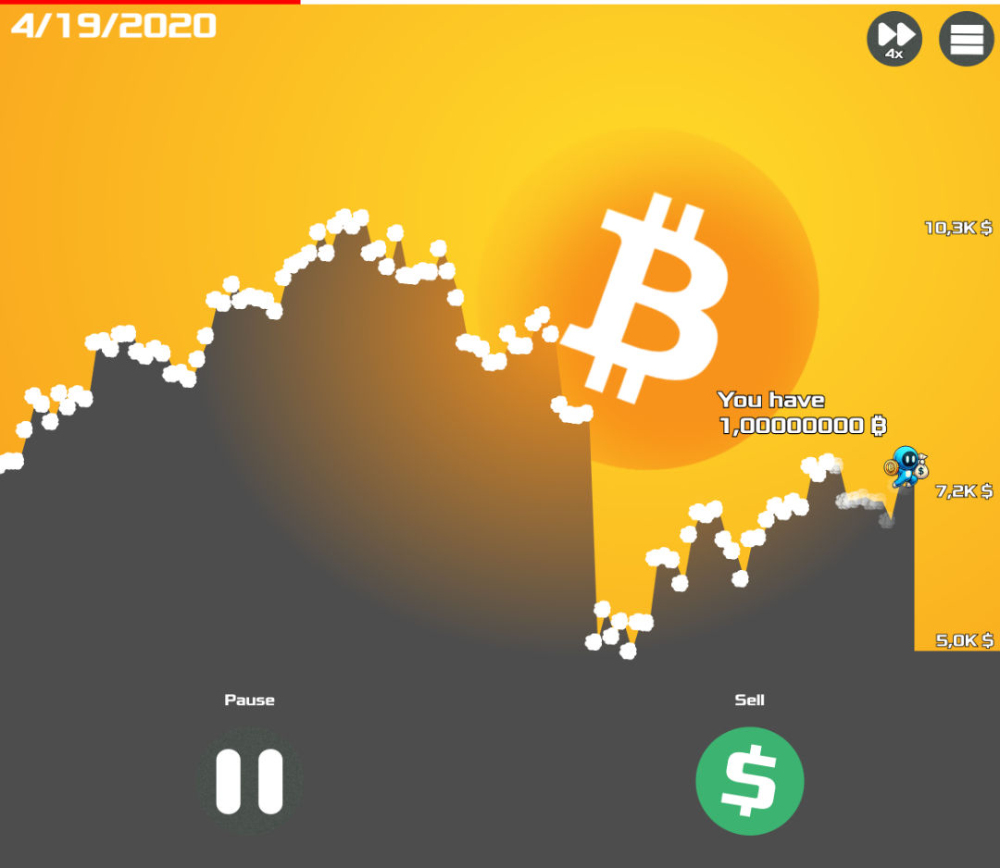
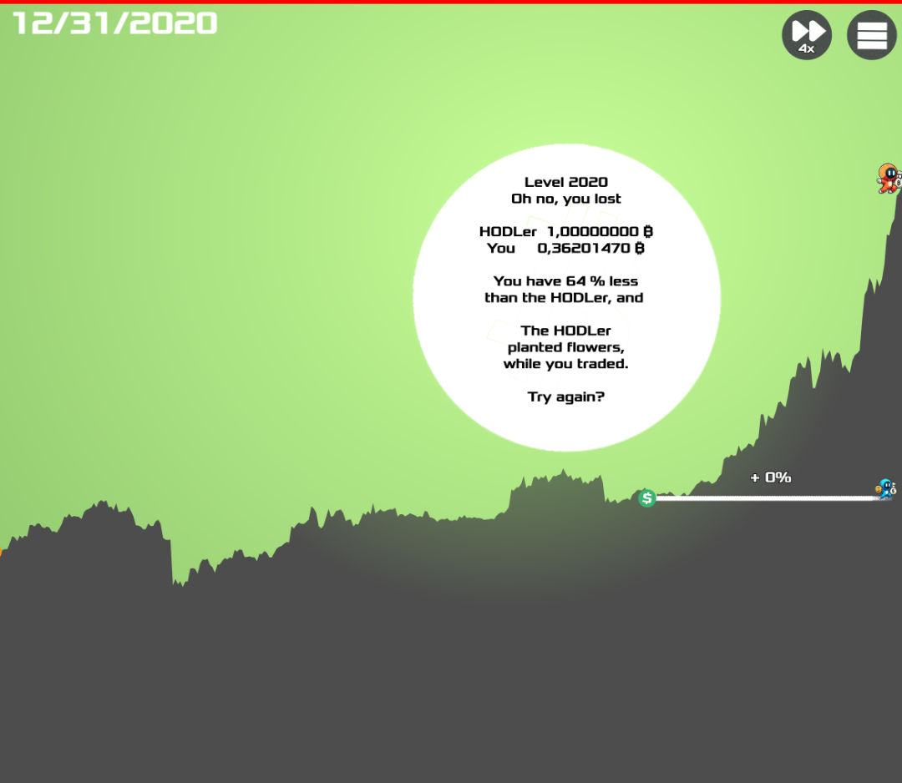

# Beat the HODLer

Welcome to the ultimate Bitcoin challenge! Your goal is simple: outperform the HODLer.

## Preview

- Production: https://beatthehodler.feuerware.com
- Dev: https://alexanderthurn.github.io/coinswiper/
- Source: https://github.com/alexanderthurn/coinswiper

## Author

Alexander Thurn

## Engine

Pixi.js: https://pixijs.com/

## Data

https://www.coingecko.com/en/coins/bitcoin/historical_data?start=2009-1-1
https://www.coingecko.com/en/coins/ethereum/historical_data?start=2009-1-1
https://www.coingecko.com/en/coins/solana/historical_data?start=2009-1-1
https://www.coingecko.com/en/coins/dogecoin/historical_data?start=2009-1-1
https://www.coingecko.com/en/coins/cardano/historical_data?start=2009-1-1

## Crypto Logos

https://cryptologos.cc/bitcoin
https://cryptologos.cc/

ADA: 0033AD FFFFFF
SOL: B24AEE  FFFFFF
BTC: F7931A FFFFFF
USD: 3CB371
DOGE: BA9F32  F7F0DE
ETH: 383938 FFFFFF

## Font

https://www.fontspace.com/xolonium-font-f17644

license: SIL Open Font License (OFL)
link: https://www.fontspace.com/xolonium-font-f17644

## sfx

https://jfxr.frozenfractal.com/

Win Sound Effect by <a href="https://pixabay.com/users/u_ss015dykrt-26759154/?utm_source=link-attribution&utm_medium=referral&utm_campaign=music&utm_content=146260">u_ss015dykrt</a> from <a href="https://pixabay.com//?utm_source=link-attribution&utm_medium=referral&utm_campaign=music&utm_content=146260">Pixabay</a>

Lose Sound Effect by <a href="https://pixabay.com/users/make_more_sound-35032787/?utm_source=link-attribution&utm_medium=referral&utm_campaign=music&utm_content=145828">Jesse Grum</a> from <a href="https://pixabay.com/sound-effects//?utm_source=link-attribution&utm_medium=referral&utm_campaign=music&utm_content=145828">Pixabay</a>

ascending-tones-168471

Sound Effect by <a href="https://pixabay.com/users/shut_up_ghost-32917765/?utm_source=link-attribution&utm_medium=referral&utm_campaign=music&utm_content=168472">Ghostie Graves</a> from <a href="https://pixabay.com//?utm_source=link-attribution&utm_medium=referral&utm_campaign=music&utm_content=168472">Pixabay</a>

Sound Effect by <a href="https://pixabay.com/users/shut_up_ghost-32917765/?utm_source=link-attribution&utm_medium=referral&utm_campaign=music&utm_content=168473">Ghostie Graves</a> from <a href="https://pixabay.com//?utm_source=link-attribution&utm_medium=referral&utm_campaign=music&utm_content=168473">Pixabay</a>

## Icon Pack

https://forum.affinity.serif.com/index.php?/topic/139587-icon-pack/

## Performance optimizations notes
01.02.2025: 

Before Optim:
Normal: No TP, but parallel: 57 requests - 1,50s 3.2mb transferred  2.6 MB resources DOMContentLoaded 1.17s Loaded 1.18s
Slow 4G: Finish: 22.40s DOMContentLoaded 3.33 s Load 3.33s

After:
Normal: No TP, but parallel: 26 requests - 652ms 3.1MB transferred  2.6 MB resources DOMContentLoaded 319ms Loaded 323ms
Slow 4G: Finish: 21.57s DOMContentLoaded 3.335 s Load 3.335s

## Development

- Install python3
- Open a terminal and run `python3 -m http.server 3333`
- Open `http://localhost:3333` in your webbrowser. If it says it is insecure due to http, open it in another browser or in private mode

## TODO

- zoom button / mouse wheel?
- graph as shader only

## Licenses

- Code: 
- Pixabay Resources: <a href="https://pixabay.com/service/license-summary/">pixabay.com</a>
- for the other assets please check out their websites
